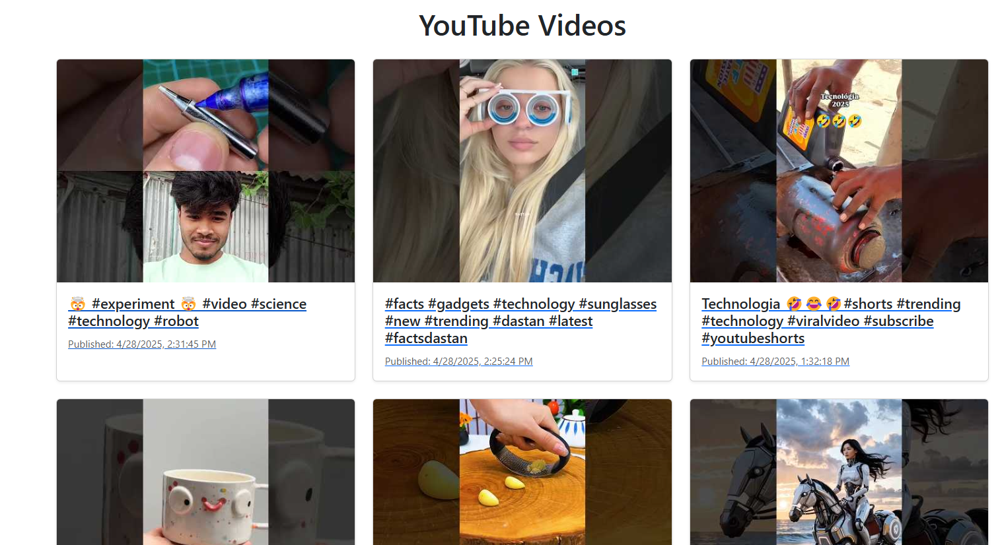

# 📺 YouTube Latest Videos Fetcher API

This project continuously fetches the latest videos from YouTube for a **high-frequency search query** (`technology`) every 10 seconds and stores them in **MongoDB**.  
It provides APIs to **retrieve** and **search** the stored videos.

---

## 🚀 Features

- Fetches latest YouTube videos based on the search query: **`technology`**.
- Stores video title, description, publish datetime, thumbnails, and channel information.
- Provides paginated API to get videos sorted by latest.
- Provides search API to find videos by partial matches in title or description.
- Dockerized setup available.
- Clean code, meaningful names, and well-documented.

---

## 📋 API Endpoints

### 1. Get Paginated Videos
```http
GET /api/videos?page=1&limit=10
```
- `page` - Page number (default: 1)
- `limit` - Number of videos per page (default: 10)

---

### 2. Search Videos
```http
GET /api/videos/search?q=yourquery
```
- `q` - Search keyword (required)

Example: `/api/videos/search?q=ai`

---

## ⚙️ How to Run the Program

### 1. Clone the Repository
```bash
git clone https://github.com/Mapur2/youtubeApi
cd youtubeApi
```

### 2. Install Dependencies
```bash
npm i
```

### 3. Create `.env` File
Create a `.env` file in the root with the following content:

```env
PORT=3000
YOUTUBE_API_KEY=YOUR_YOUTUBE_API_KEY_HERE
MONGO_URI=your_mongodb_connection_string
SEARCH_QUERY=technology
```

Replace `YOUR_YOUTUBE_API_KEY_HERE` and `your_mongodb_connection_string` with your actual credentials.

---

### 4. Run the Server
```bash
node index.js
```

---

## 📸 Screenshot

> Add a screenshot of your API running or Postman request here.



---


## ✨ Future Enhancements

- API Key rotation when quota exceeds.
- Build a basic dashboard for viewing videos.
- Optimize search using MongoDB text indexes.

---

# 🔥 Happy Building!
